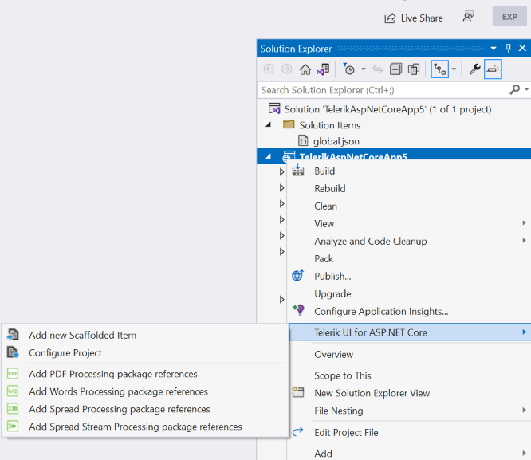

# Telerik Document Processing

Telerik Document Processing provides the RadPdfProcessing, RadSpreadProcessing, RadSpreadStreamProcessing, RadWordsProcessing, and RadZipLibrary UI-independent and cross-platform libraries which enable you to process content between different formats and work with archive files.

* The [RadPdfProcessing](https://docs.telerik.com/devtools/document-processing/libraries/radpdfprocessing/overview) library enables you to create, import, and export PDF documents.
* The [RadSpreadProcessing](https://docs.telerik.com/devtools/document-processing/libraries/radspreadprocessing/overview) enables you to effortlessly convert documents from one to another file format among XLSX, XLS, CSV and TXT.
* The [RadSpreadStreamProcessing](https://docs.telerik.com/devtools/document-processing/libraries/radspreadstreamprocessing/overview) library enables you to read or export large `XLSX` and `CSV` spreadsheet documents with low memory footprint and great performance.
* The [RadWordsProcessing](https://docs.telerik.com/devtools/document-processing/libraries/radwordsprocessing/overview) library enables you to create, import, and export `DOCX`, `DOC` & `DOT` (import only), `HTML`, `RTF`, and `TXT` documents, and export them to PDF.
* The [RadZipLibrary](https://docs.telerik.com/devtools/document-processing/libraries/radziplibrary/overview) library enables you to compress and decompress `ZIP` files.

## Supported File Formats

The Telerik Document Processing libraries for .NET Core support the following file formats:

* `CSV`
* `DOC` & `DOT` (import only)
* `DOCX`
* `HTML`
* `PDF`
* `RTF`
* `TXT`
* `XLSX`
* `XLS`
* `XLSM`
* `ZIP`

## Available NuGet Packages

Telerik Document Processing supports [.NET Standard 2.0](https://github.com/dotnet/standard/blob/master/docs/versions/netstandard2.0.md). You can take the required packages from the `C:\Program Files (x86)\Progress\Telerik UI for ASP.NET Core <version>\dpl` installation folder of the dpl product.

* `Telerik.Documents.Core.nupkg`&mdash;The main NuGet package from the Telerik Document Processing libraries. Required when you plan to use the library.
* `Telerik.Documents.Flow.nupkg`&mdash;The package is part of the Word (text) processing library. Required for processing `HTML`, `DOCX`, `RTF`, and `TXT` documents.
* `Telerik.Documents.Flow.FormatProviders.Doc.nupkg`&mdash;The package allows for importing flow documents from `DOC` or `DOT` files.
* `Telerik.Documents.Flow.FormatProviders.Pdf.nupkg`&mdash;The package allows for exporting flow documents, such as `DOCX` and `RTF`, to PDF.
* `Telerik.Documents.SpreadsheetStreaming.nupkg`&mdash;The main package for reading and generating huge spreadsheet files while using minimum resources.
* `Telerik.Documents.Fixed.nupkg`&mdash;The package is required when processing PDF documents.
* `Telerik.Documents.CMapUtils.nupkg`&mdash;This package provides you with access to predefined CMap tables. It is optional an you will need it only if you have to work with documents that contain [CMap tables](https://docs.telerik.com/devtools/document-processing/libraries/radpdfprocessing/concepts/cmaps).
* `Telerik.Documents.ImageUtils.nupkg`&mdash;To export images different than Jpeg and Jpeg2000 or ImageQuality different than High you will need to add a reference to this package. Depends on [Magick.NET](https://github.com/dlemstra/Magick.NET).
* `Telerik.Documents.Spreadsheet.nupkg`&mdash;The main assembly for the spreadsheet processing. It is needed for processing XLSX, XLS, CSV, TXT documents.
* `Telerik.Documents.Spreadsheet.FormatProviders.OpenXml.nupkg`&mdash;Allows import/export of spreadsheet document model from/to XLSX.
* `Telerik.Documents.Spreadsheet.FormatProviders.Xls.nupkg`&mdash;Allows import/export of spreadsheet document model from/to XLS.
* `Telerik.Documents.Spreadsheet.FormatProviders.Pdf.nupkg`&mdash;Allows export of spreadsheet documents to PDF.
* `Telerik.Zip.nupkg`&mdash;The package is required when working with zipped formats, such as `DOCX` and `XLSX`, and PDF.

>In case you need a version of Telerik Document Processing compatible with [.NET Framework 4.0](https://dotnet.microsoft.com/download/dotnet-framework/net40) or later, check the suites which you can use to obtain the binaries from in the [Installing on Your Computer](https://docs.telerik.com/devtools/document-processing/getting-started/installing-on-your-computer) help topic.

## DPL Configuration Wizard 

Adding DPL NuGet references to the project using the `dpl` folder in the distribution that the project uses. There are a couple of images showing how the wizard is launched and its main page.

### Wizard launch context menu:

### Wizard launch main menu:

### Wizard main page:

## Licensing

Telerik Document Processing is available as part of the following suites:

* DevCraft
* Telerik UI for Blazor
* Telerik UI for .NET MAUI
* Telerik UI for ASP.NET AJAX
* Telerik UI for ASP.NET MVC
* Telerik UI for ASP.NET Core
* Telerik UI for WinUI
* Telerik UI for WPF
* Telerik UI for WinForms
* Telerik UI for Silverlight
* Telerik UI for Xamarin

## See Also

* [Get Started with Telerik Document Processing](https://docs.telerik.com/devtools/document-processing/installation-and-deployment/installing-on-your-computer)
* [Telerik UI for ASP.NET Core Overview]()
